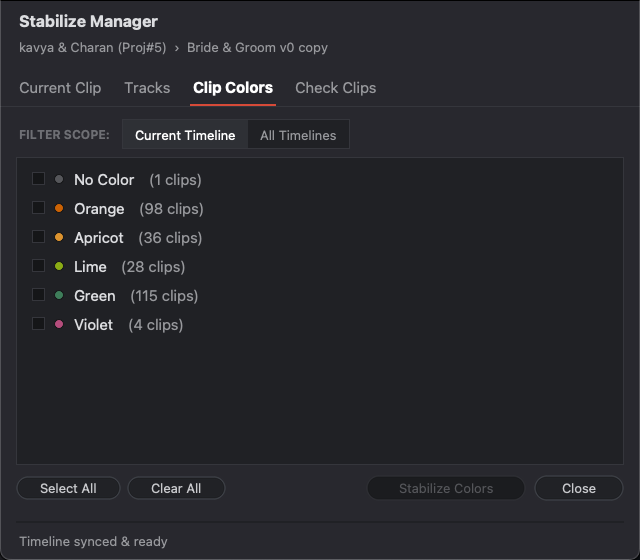
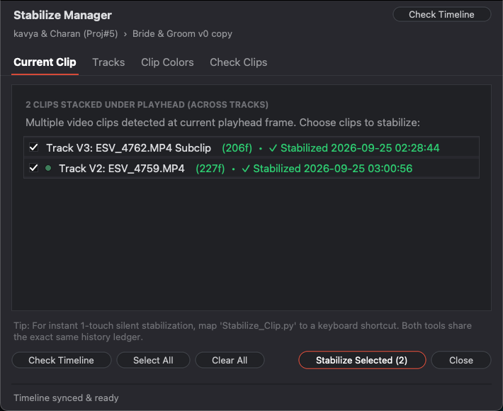
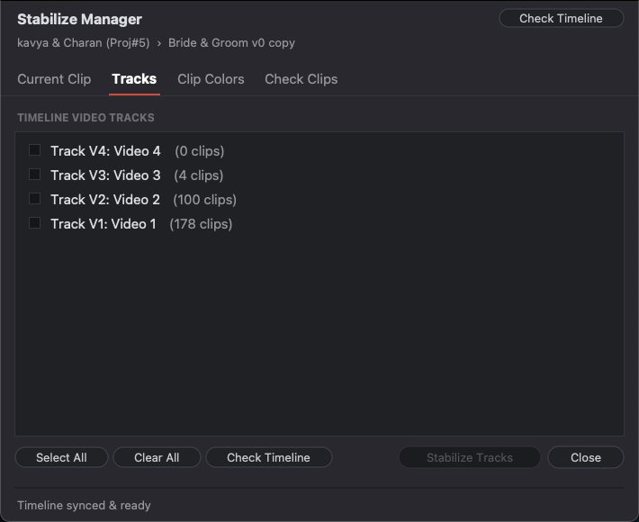
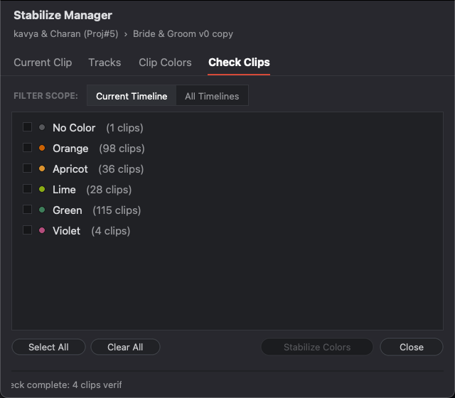

# ⚡ Stabilize Manager for DaVinci Resolve

> Native batch stabilization manager and instant 1-click silent stabilizer with intelligent re-trim auditing.

Part of the **whoopseditor** suite for DaVinci Resolve.

 
 

  

  

---

> ⭐ **If this tool saves you time, please give this repository a star!** It helps more video editors discover free workflow tools.

---

## 🛠 Features

| Tab | Preview | Description |
| :--- | :---: | :--- |
| **Current Clip** |  | Fast stabilization of whatever clip is currently under your playhead. |
| **Video Tracks** |  | Select any video tracks (V1, V2, V3...) to batch stabilize sequentially. |
| **Clip Colors** |  | Filter and batch-stabilize clips by color tags (or uncolored clips). Supports Current Timeline & Entire Project. |
| **Check Clips** |  | Intelligent edit-point auditor: flags re-trimmed or lengthened clips and re-stabilizes in 1 click. |

### ⚡ Silent Hotkey Stabilizer (`Stabilize_Clip`)
Assign a custom shortcut in DaVinci Resolve (**Keyboard Customization** → **Scripts** → `Stabilize_Clip`) for background 1-key stabilization with zero UI interruption!

---

## 🚀 Quick Installation

> 🌐 **First-Time Setup**: Please ensure you have an active internet connection when running the installer for the first time. The installer automatically provisions and configures the required Python 3 runtime in the background with zero manual configuration needed!

### macOS:
Double-click `Install_Mac.command`. (Done!)  
*(If macOS prompts "unidentified developer": Right-click `Install_Mac.command` → select **Open** → click **Open**).*

### Windows:
Right-click `Install_Windows.bat` and click **Run**. (Done!)  
*(If Windows prompts "The publisher could not be verified": Simply click **Run**).*

### Manual Installation:
Copy `Stabilize_Manager.py` and `Stabilize_Clip.py` to:
* **macOS**: `~/Library/Application Support/Blackmagic Design/DaVinci Resolve/Fusion/Scripts/Edit/`
* **Windows**: `%APPDATA%\Blackmagic Design\DaVinci Resolve\Support\Fusion\Scripts\Edit\`

  

---

## 🎁 100% Free for the Community
All tools in **whoopseditor** are **100% free** for both personal and commercial projects. No paywalls, no subscriptions.

## 💡 Got a DaVinci Resolve Bottleneck?
Facing a repetitive, annoying editing problem or have an idea for a tool that would save hours of work?  
**Drop me a message! If it's a problem other editors face too, I will build the tool and release it for FREE.**

* 💬 **Instagram DM**: [@whoopseditor](https://instagram.com/whoopseditor) or [@i.vkpraveenkumar](https://instagram.com/i.vkpraveenkumar)
* 📧 **Email**: [editempathy@gmail.com](mailto:editempathy@gmail.com)
* 💡 **Feature Requests**: Open an [Issue](https://github.com/whoopseditor/DaVinci-Resolve/issues) on GitHub
